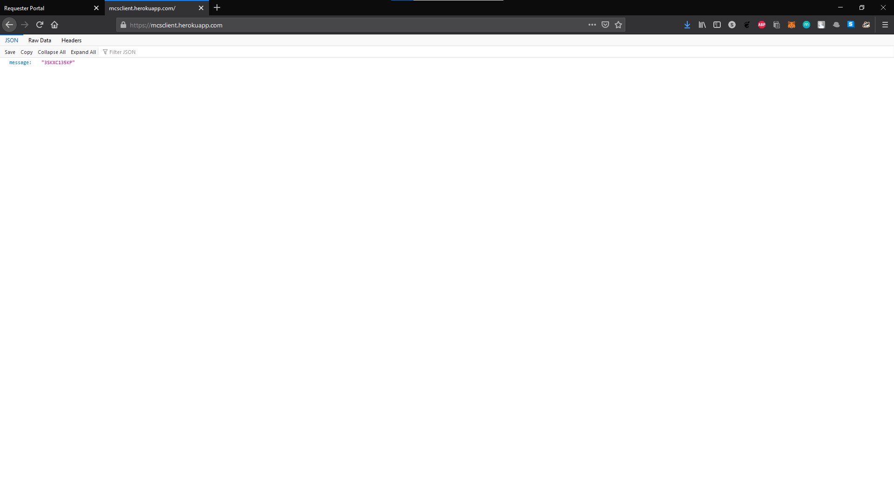
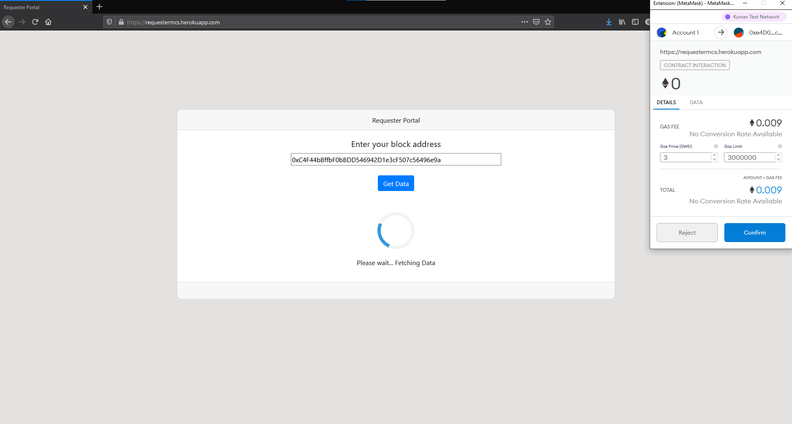
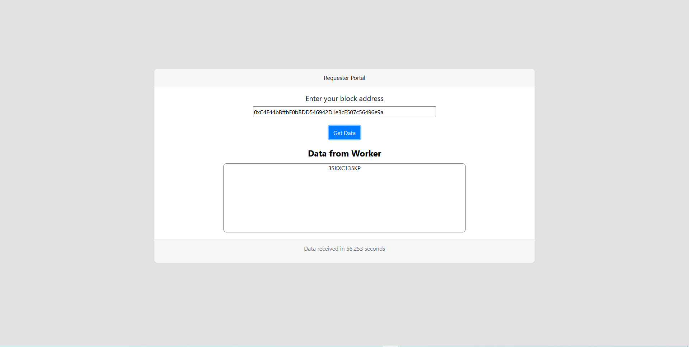

# Blockchain-based-MCS-system

This is a decentralized blockchain based Mobile crowdsensing system that works on the basis of Blockchain oracles. The entire idea of this application is to isolate the worker from being part of the blockchain while making transactions. This prevents the system from being vulnerable to attacks like [Eclipse attacks](https://academy.binance.com/en/articles/what-is-an-eclipse-attack) and [Sybil attacks](https://academy.binance.com/en/articles/sybil-attacks-explained) which are primarily caused because of malicious workers present in the chain.

To make sure that the worker remains off the chain during the transaction process, blockchain oracles are employed, that push data from an external source , into the chain. It does this by retrieving data from a public API where the worker data is fed automatically and pushes it to the public chain. This enables the system to be a lot more privacy preserving and secure when compared to a conventional blockchain based system. We have gone with a decentralized Oracle framework, [Chainlink](https://chain.link). Further information regarding the overall working of Chainlink can be found [here](https://www.gemini.com/cryptopedia/what-is-chainlink-and-how-does-it-work).

The requester portal and client API are hosted on Heroku and can be found at https://requestermcs.herokuapp.com and https://mcsclient.herokuapp.com respectively.

## Components

<ins>Client</ins>: This is the public API written on Flask . It works on a context-aware method where data is fed automatically into the API based on a particular context, in this case, time interval. The API is also made secure by safely removing the data present in it after a particular time interval to make the API inaccessible to anyone until the next stream of data arrives.

<ins>Requester Portal</ins>: This is the frontend portal for the requester to make a request for the worker data. This request is transferred through the smart contract, and the response is retrieved from the API and transferred back to the public chain.

<ins>Smart Contract</ins>: The smart contract here is the agreement between the requester and the chainlink portal(which essentially connects with the public API) which initiates the transaction for the data and thereby , also pushing it to the requester's block in the chain. The smart contract has been written on Remix IDE using Solidity.

## Screenshots

### Data in API

### Requester makes request for data

### Confirmation of transaction by Metamask

### Data received upon successful transaction

At an average, the entire transaction takes 55 seconds.
